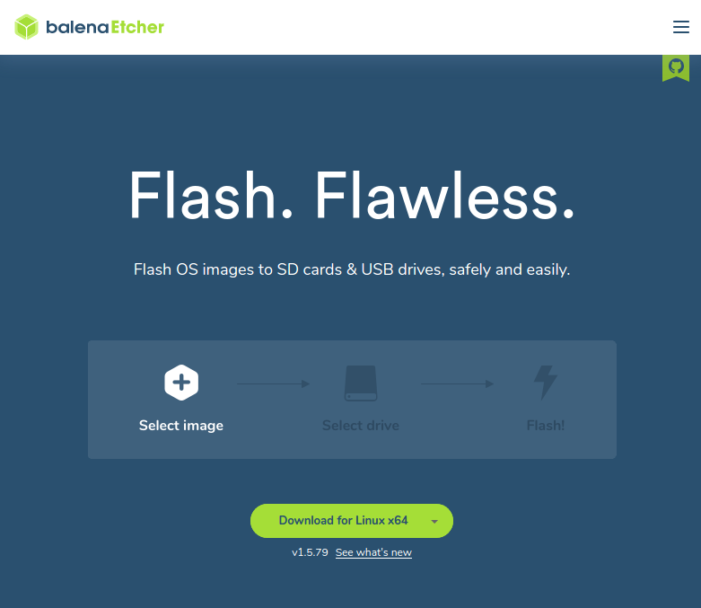
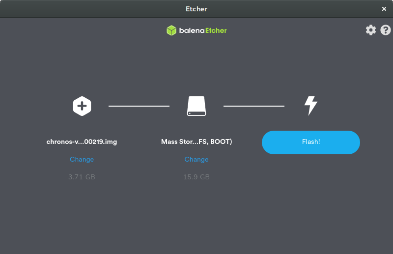
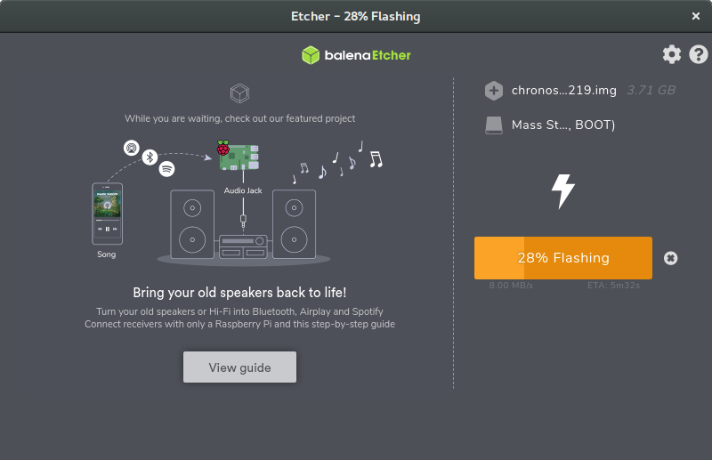
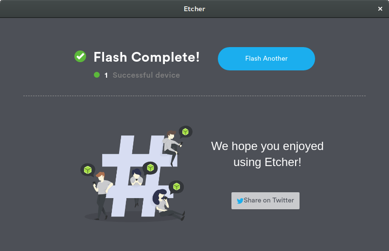

Getting Started with Debian
===========================

Step 1: Backup Factory Calibration
----------------------------------
This step is required for Chronos 2.1 users, failure to do so may result in
degrated image quality due to missing calibration files after the upgrade.
Users of the Chronos 1.4 may skip this step, and re-generate their calibration
data in step 5.

To backup your factory calibration data:
 1. Insert a FAT32-formatted USB drive into the USB/eSATA port on the side of the camera.
 2. Navigate to the Storage tab of the Util Window.
 3. Tap the `Backup Calibration Data` button to begin the backup procedure.
 4. If successful, a message box will apear showing `Calibration backup successful`
 5. Tap `Ok` to close the message box.
 6. Tap the `Eject Disk` button to safely eject the USB drive.

Step 2: Download the Latest Software Image
------------------------------------------
Download the latest Debian image from [debian.krontech.ca/builds](http://debian.krontech.ca/builds).
The image file will have an img.xz extension, and contains a sector-by-sector
compressed image of the microSD card.

| Release  | Version | Status
|----------|---------|-------------
| voyager  | 0.4.0   | Beta testing
| unstable | none    | Active development

The `voyager` release is currently in beta testing, and represents a state of
our software that has received some testing to flush out bugs. The features
available in this release should be stable, and change only as necessary to
resolve bugs.

The `unstable` builds are generated nightly whenever new software is commited
to our software repositories, and will always contain the bleeding edge code
and latest features. However, this is not recommended except for development
use, as software may break and APIs may change without notice.

Step 3: Connect the microSD Card to Your Computer
-------------------------------------------------
Use your computer's microSD card slot, or a USB adaptor to connect the microSD
card to your computer. You will need to use a microSD card at least 4GB in size
to install the Debian filesystem image.

Step 4: Write the Image to Your microSD Card
--------------------------------------------
There are several options available to write the Debian filesystem image to your
microSD card, depending on which operating system you are using.

### With [balenaEtcher](https://www.balena.io/etcher/)
BalenaEtcher is an open-source tool that can be used to decompress and write filesystem
images to storage media, such as the microSD card that the Chronos cameras use for
their operating systems. BalenaEtcher is available for Windows, macOS and Linux.



When starting balenaEtcher, select the img.xz file that you want to install, the
storage device it is to be written to, and then click the `Flash!` buton to begin
the flashing process.



After starting the flashing process, balenaEtcher will display a progress bar as it
first flashes, and then verifies the written image to the microSD card.



Finally, when flashing is completed. You can remove the microSD card from your
computer.



### Linux Command Line
The image can be written directly to a microSD card using the `xz` and `dd` tools.
However, **this tool can be extremely dangerous if misused** (it is sometimes refered
to as the disk destroyer), and it will just as easily overwrite your computer's root
filesystem as it will the microSD card if you set the output device incorrectly.

First locate the block device of the microSD as it was detected by your operating
system. In this example, it appears as `/dev/sdX`.
```
user@example:~$ lsblk -p
NAME                                       MAJ:MIN RM   SIZE RO TYPE  MOUNTPOINT
/dev/nvme0n1                               259:0    0   477G  0 disk  
├─/dev/nvme0n1p3                           259:3    0 475.7G  0 part  
│ └─/dev/mapper/nvme0n1p3_crypt            253:0    0 475.7G  0 crypt 
│   ├─/dev/mapper/ubuntu--gnome--vg-root   253:1    0 474.8G  0 lvm   /
│   └─/dev/mapper/ubuntu--gnome--vg-swap_1 253:2    0   980M  0 lvm   [SWAP]
├─/dev/nvme0n1p1                           259:1    0   512M  0 part  /boot/efi
└─/dev/nvme0n1p2                           259:2    0   732M  0 part  /boot
/dev/sdX                                     8:16   1  14.9G  0 disk  
├─/dev/sdX2                                  8:18   1   3.4G  0 part  /media/user/ROOTFS
└─/dev/sdX1                                  8:17   1  39.2M  0 part  /media/user/BOOT
```

Before we can write an image to the microSD card, we must first ensure that it is not
mounted by your operating system. We can use the lsblk tool to list any devices mounted
for this card, and unmount them as needed.
```
user@example:~$ for part in $(lsblk -n -o MOUNTPOINT /dev/sdX); do umount $part done
```

The image can then be decompressed and written directly to the block device as follows.
Depending on the write speed of your microSD card. The decompressed image will be approximately
3.5GB in size, and can take between 5 and 15 minutes to complete writing.
```
user@example:~$ xzcat chronos-voyager-20200225.img.xz | sudo dd of=/dev/sdX status=progress
```

### Other Links
The process described here is very similar to the installation of many other embedded
Linux systems. You can find similar guides for both the
[Raspberry Pi](https://www.raspberrypi.org/documentation/installation/installing-images/)
and [Beaglebone](https://beagleboard.org/getting-started).

Step 5: Insert the microSD Card into Your Camera
------------------------------------------------
Insert the microSD card into the slot located on the bottom of your camera, near
the model and serial number. You will need to push the card in passed the detent
to ensure it stays latched in place.

Once installed, you can now power the camera on. You should be greeted with a
Chronos boot logo, and eventually the user interface.

Step 6: Restore Factory Calibartion
-----------------------------------
After installing a new software image onto your microSD card, it is important to
restore the factory calibration data to maintain the image quality of your Chronos
camera.

### Chronos 1.4: Generate Calibration
Users of the Chronos 1.4 can generate their calibration data automatically by
navigating to the Factory tab of the Util Window, and tapping the 
`Black Cal All Standard Resolutions` button. This procedure can take up to 10
minutes to complete, and should be performed only once the camera has warmed up
to its normal operating temperature.

### Chronos 2.1: Restore Calibration
Users of the Chronos 2.1 must restore their calibration data by copying it off
their camera before upgrading, as their camera is not capable of generating its
own calibration data. To restore the calibration data:
 1. Insert the USB drive with factory calibration data on it from step 1.
 2. Navigate to the Storage tab of the Util Window.
 3. Wait for the USB drive to appear in the USB/SATA storage status box.
 4. Tap the `Restore Calibration Data` button to copy the calibration data
    back onto the microSD card.
 5. Tap the `Eject Disk` button to safely eject the USB drive.

Creating Debian Images
======================
Debian filesystem images for the Chronos camera are generated using the `multistrap`
and `qemu-user-static` tools. The first tool downloads packages from the Debian and
Krontech repositories and unpacks them into a staging directory. The emulator,
`qemu`, is then used to emulate an ARM machine, which is able to setup and configure
the staging directory into a bootable root filesystem.

A collection of scripts can be found in the `scripts` directory that can assist the
user in building a filesystem image.

| Scripts                | Description
|------------------------|--------------
|`chronos-debootstrap.sh`| Builds a Debian filesystem into a staging directory (`$(pwd)/debian` by default)
|`chronos-mkimage.sh`    | Builds a Debian filesystem into a image file, with optional compression.
|`chronos-chroot.sh`     | Emulate an ARM machine that using the staging directory as its root filesystem.
|`mksd-format.sh`        | Formats a microSD card, and copies the filesytems from a staging directory.
|`hooks/*.sh`            | Hook scripts used by `multistrap` to setup and customizate the filesystem.
|`chronos-*.conf`        | Configuration files used by `multistrap` to select packages and repositories.

Debootstrap: Building a Staging Directory
-----------------------------------------
The first method to produce an image is to create a staging directory that will contain
the root filesystem of the camera, and using the `chronos-debootstrap.sh` script to
populate it with an initial Debian installation. This method is convenient for development
but requires root permissions and does not work well for reproduceable and automated builds.

Start by invoking the `chronos-debootstrap.sh` script to build the filesystem image. This
will create a directory at `$(pwd)/debian`. The `-s` option shown here selects the `suite`
or release codename for for the software release.

```
user@example:~/chronos-updates$ ./scripts/chronos-debootstrap.sh -s voyager
```

Once completed, the `mksd-format.sh` script can be used to format a microSD card and copy
the filesystems onto the card. This script takes a single argument giving the block device
to which the filesystem should be written.

```
user@example:~/chronos-updates$ ./scripts/mksd-format.sh /dev/sdX
```

Once complete, you can remove the SD card, and install it into a Camera.

mkimage: Building a Compressed microSD Image
--------------------------------------------
The second method to produce an image is to create a loopback device to create an image
the microSD card, and then debootstrap the new Debian filesystem directly onto the loopback
device. The method can operate with fewer root permissions and lends itself better to
creating automated and reproduceable builds.

Start by invoking the `chronos-mkimage.sh` script. The final argument of this script is 
the name of the image file to create. All other arguments to this script are passed without
modification to the `chronos-debootstrap.sh` script.

```
user@example:~/chronos-updates$ ./scripts/chronos-debootstrap.sh -s voyager chronos-voyager.img.xz
```

The suffix of the image file will determine what type of compression should be applied to the
image, and the following patterns are recognized:

| Pattern | Compression Type  | microSD Programming Command
|---------|-------------------|:---------------------------
| `*.gz`  | GZIP compression  | `zcat filename.gz \| sudo dd of=/deb/sdX status=progress`
| `*.bz2` | Bzip2 compression | `bzcat filename.bz2 \| sudo dd of=/dev/sdX status=progress`
| `*.xz`  | LZMA compression  | `xzcat filename.xz \| sudo dd of=/dev/sdX status=progress`
| otherwise | No compression  | `sudo dd if=filename of=/dev/sdX status=progress`

Builds of the microSD card image will require root permissions to execute the `multistrap` and
`losetup` tools, and must grant `pmount` the ability to mount loopback devices. On an operating
system with `sudo`, this configuration might look like the following:

```
user@example:~$ cat /etc/sudoers.d/multistrap
user      ALL=(ALL) SETENV:/usr/sbin/multistrap
user      ALL=(ALL) /sbin/losetup

user@example:~$ cat /etc/pmount.allow
# /etc/pmount.allow
# pmount will allow users to additionally mount all devices that are
# listed here.
/dev/loop[0-9]*
```
